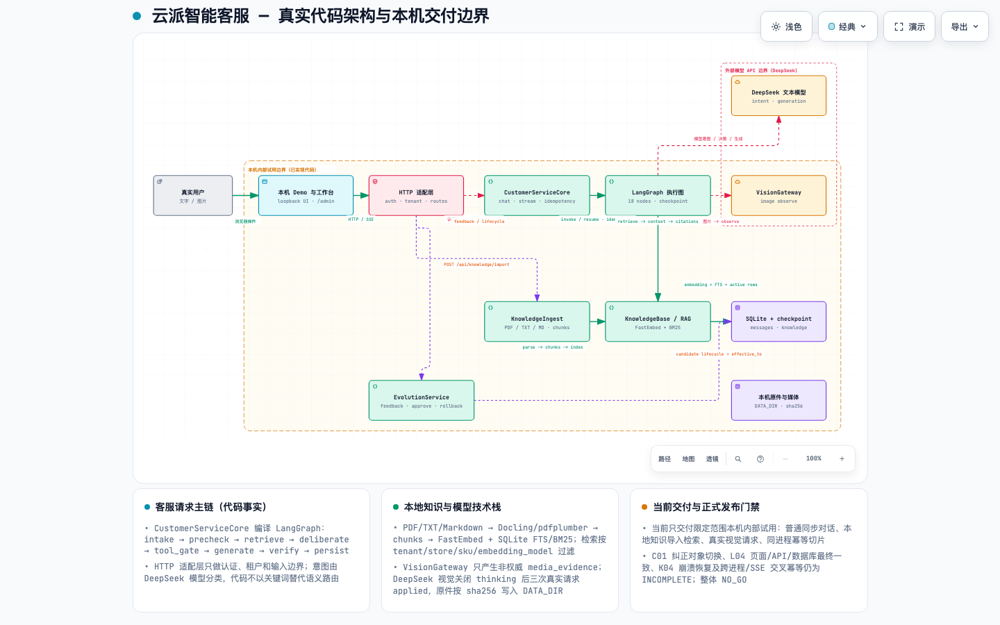

# yunpai-customer-service

独立可安装的智能客服模块：对话（同步 + 流式）、会话记忆、话术匹配（RAG / 审核精确复用）、自沉淀（反馈 → 评测门禁 → 审批 → 回滚）。

最新框架审计见 [2026-09-10 审计报告](docs/framework-audit-2026-09-10.md)，包含已复现缺陷、修复证据和仍待验收的边界。此前测试通过不代表生产上线已验收。

当前实现结构见 [可交互架构图](docs/architecture/yunpai-customer-service.html)，其可审计规格见 [架构 JSON](docs/architecture/yunpai-customer-service.architecture.json)。图中标出了真实用户、本机 HTTP 工作台、客服图、DeepSeek、本地知识层、SQLite 和知识治理之间的边界。



结构图依据当前源码生成，主要技术链是：FastAPI Demo/Host API → `CustomerServiceCore` → LangGraph 状态图 → DeepSeek 文本/视觉网关；本地侧使用 Docling/pdfplumber、FastEmbed、SQLite FTS/BM25、LangGraph checkpoint 和自进化治理服务。图中的技术细节以代码为准，未把尚未证明的生产部署、跨进程恢复或真实业务账本画成已交付能力。

本仓库从 [yunpai-ecommerce-agent](https://github.com/a1024053774/yunpai-ecommerce-agent) 拆出，**两边互不依赖**。原仓库继续自己运转；其他项目用本包即可，不必引入整套电商运营 Agent。

不包含：淘宝渠道、商品/订单经营工具、润色模型。

文本决策和意图识别统一使用 DeepSeek `deepseek-v4-flash`，通过输入安全检查的业务消息由共享模型结合有限历史和图片观察判断，不使用关键词分类 shortcut。意图识别超时默认 15 秒，与真实模型响应延迟匹配；超时只进入可观测的安全降级。顾客图片由 `deepseek-v4-flash-vision-exp` 做非权威观察，再交给文本模型决策/生成。图片不能授权退款、改地址等业务动作。

## 安装

```bash
pip install "git+https://github.com/a1024053774/yunpai-customer-service.git"
```

需要 Python 3.11+。对话图用 LangGraph + SQLite。

## 启动示例聊天页

在仓库根目录操作。这是 zsh/bash 脚本流程，不要把命令包进 Markdown 代码块后再 `source`。

**第一次：**

```bash
cd /path/to/yunpai-customer-service
python3.11 -m venv .venv
source .venv/bin/activate
pip install -e ".[demo,rag-semantic,pdf-advanced]"
cp env.example.md env.md
chmod 600 env.md
```

`env.example.md` 是仓库内可提交的无密钥模板；`env.md` 是你自己的本地配置，已被 `.gitignore` 忽略。编辑 `env.md`，填入 `MODEL_API_KEY` 后即可调用真实模型；留空则 Demo 自动使用 mock，不影响页面和预置问答体验。视觉模型默认复用文本模型的地址和 Key，也可以在 `env.md` 中单独设置 `VISION_BASE_URL`、`VISION_API_KEY` 和 `VISION_MODEL_NAME`。

**以后每次：**

```bash
cd /path/to/yunpai-customer-service
source env.md          # 激活 .venv，并导出本地模型配置
yunpai-cs-demo
```

浏览器打开 http://127.0.0.1:8765/ 。示例只监听回环地址，并预装「晴川小家电」模拟店（空气炸锅 / 加湿器 / 挂烫机）。

`env.md` 必须保持为可被 zsh/bash `source` 的 shell 文件：使用 `export KEY=value` 设置变量、使用 `#` 写注释，不要加入 Markdown 代码围栏。若设置 `RAG_EMBEDDING_PROVIDER=fastembed`，首次安装必须包含 `.[rag-semantic]`。这是本机 ONNX 向量，不是收费云端向量库。复杂 PDF 版式再安装 `.[pdf-advanced]`（Docling，MIT）。不要强制添加或提交 `env.md`。

单独激活虚拟环境也可以：

```bash
source .venv/bin/activate
```

## 用法

```python
from yunpai_customer_service import ChatImageInput, CustomerServiceCore
from yunpai_customer_service.auth import AuthenticationService
from yunpai_customer_service.config import Settings
from yunpai_customer_service.database import Database

settings = Settings.from_env()
settings.ensure_directories()
db = Database(settings.app_db_path)
db.initialize()

core = CustomerServiceCore.build(db, settings)
principal = AuthenticationService(db, settings).authenticate(
    settings.bootstrap_client_id,
    settings.bootstrap_client_key,
    "buyer-1",
)
response = core.chat(principal, session_id="web-1", message="这个怎么保养？")
print(response.answer)
# 带图片时传入 ChatImageInput（PNG/JPEG/WebP，≤5 MiB）
```

宿主只需要注入自己的模型、工具或知识库；不注入时 `build()` 会装配默认协作对象。

```python
core = CustomerServiceCore.build(db, settings, model=your_model, tools=your_tools)
```

独立站后端可安装 `.[api]`，启用 `AUTH_REQUIRED=true` 并配置客户端密钥、`SUBJECT_HASH_KEY` 后，用 `create_api_app(core)` 暴露 `/v1/chat`、`/v1/chat/stream` 和 `/v1/health`。接口从 `X-Client-Id`、`X-Client-Key`、`X-Subject-Id` 认证并保持租户隔离，同步和 SSE 都实际执行同一编译图中的生成与审核节点。当前 SSE 在审核完成后一次发送最终答案，不是逐 token 对用户展示。客户端密钥只交给可信网站后端，不可下发给浏览器；本机 Demo 的免认证配置不能用于该接口。

## 能力边界

| 能力 | 入口 |
|---|---|
| 对话 | `CustomerServiceCore.chat` / `chat_stream` |
| 独立站 HTTP | `create_api_app(core)`：`/v1/chat` / `/v1/chat/stream` |
| 图片 | `ChatImageInput`：Vision 观察 → 非权威 `media_evidence` → DeepSeek 决策/生成 |
| 记忆 | 会话历史 + checkpoint；`core.memory.record/recall` 管理店铺长期记忆与买家偏好 |
| 话术匹配 | `KnowledgeBase` 检索；精确问法优先排序，审核话术仍须 normalize 后完全相等才直出 |
| 自沉淀 | `EvolutionService`：feedback → evaluate → approve → 复用 → rollback；重复纠错复用同一候选 |
| 知识工作台 | `/admin` 导入 PDF/TXT/Markdown；原件按摘要保存，可下载，重复同内容导入幂等 |
| 多业务复用 | 以 `tenant_id` 隔离店铺/组织知识、语料、记忆与反馈；已有电商链路和 HR 领域标签；HR 的模型提示、知识范围和 SOP 尚未完成业务验收 |
| 安全 | 注入拒绝、租户隔离、未授权订单字段剥离 |

独立站与 HR 的租户、意图桶、资料导入和发布边界见 [`docs/domain-reuse-contract.md`](docs/domain-reuse-contract.md)。

确定性代码不根据关键词做语义路由。意图由同一 DeepSeek Flash 模型从完整消息判断；代码只负责认证、租户范围、Schema、SOP、幂等、后置条件和发布策略。绕过模型直出，必须是已审核内容且问题完全匹配。

资料与商品数据进入租户知识库后，按场景和来源建立可追溯语料；会话反馈先形成候选经验，经评测和人工批准后才发布，支持回滚。该流程是受控的经验沉淀，不会让模型直接改写生产知识。

多轮短追问只有在当前问法没有召回、且包含“它 / 这个 / 这款”等明确指代时，
才会把上一轮用户问题作为检索语境；该检索词会贯穿后续精化检索，不改变原始用户消息。

长期记忆使用独立的 `memory` layer，不会混入普通 RAG。`recall()` 按相关度排序；
`buyer_preference` 必须绑定认证后的 `subject_hash`，避免同一店铺不同顾客之间泄漏偏好。

```python
memory_id = core.memory.record(
    store_id="store-1",
    fact="顾客偏好静音款。",
    category="buyer_preference",
    tenant_id=principal.tenant_id,
    subject_hash=principal.subject_hash,
)
```

## 测试

完整交付测试规范见 [Agent 产品完整测试手册](docs/agent-testing-manual.md)，包含历史缺陷回归、错误实现反例、模型与真实集成验收、性能恢复和发布条件；每次执行使用 [配套记录模板](docs/agent-testing-templates.md)。手册中的待测用例不代表当前已通过。

```bash
python -m venv .venv
.venv/bin/pip install -e ".[dev]"
NO_PROXY=127.0.0.1,localhost ALL_PROXY=http://127.0.0.1:9 \
  .venv/bin/python -m pytest -q
```

核心模块单测直接构建 `CustomerServiceCore` 并使用模型替身；页面交互通过 Cursor 侧边浏览器做人工点击验收，避免依赖 Chromium 测试运行时。安装 `.[pdf-advanced]` 后，导入器会优先使用 Docling 的布局/表格结构，缺页由 pdfplumber 补齐。

RAG 使用 BM25 与本机 FastEmbed 混合排序；未配置语义向量时回退到可重复的 hash 向量。不要接入 Pinecone、Weaviate Cloud 或其他按调用收费的向量库。切换 embedding 后端后，在知识工作台执行重建索引。

点击验收与截图见 [`docs/acceptance-2026-09-09.md`](docs/acceptance-2026-09-09.md)，工作汇报见 [`docs/work-report-2026-09-09.md`](docs/work-report-2026-09-09.md)。

### 当前代码库目录结构

```text
yunpai-customer-service/
├── src/yunpai_customer_service/
│   ├── api.py                    # 认证 Host API：/v1/health、/v1/chat、/v1/chat/stream
│   ├── customer_service/core.py  # CustomerServiceCore、同步/流式入口、invocation 幂等
│   ├── graph.py                  # LangGraph 状态图与 intake/retrieve/generate/verify/persist
│   ├── intent.py                 # DeepSeek 意图分类与配置化 intent routing
│   ├── vision.py                 # VisionGateway 与 media_evidence
│   ├── llm.py                    # 文本模型网关、JSON/stream、重试与可观测降级
│   ├── rag.py                    # KnowledgeBase、FastEmbed、BM25/FTS、租户/商品范围
│   ├── knowledge_ingest.py       # PDF/TXT/Markdown 解析、切块、原件摘要存储
│   ├── evolution.py              # feedback → evaluate → approve → rollback
│   ├── database.py               # SQLite schema/migrations、messages、knowledge、invocations
│   └── demo/                     # 本机聊天页、知识工作台和静态资源
├── tests/                        # 模块、API、视觉、导入、知识治理与幂等回归
├── docs/architecture/            # Archify 规格、HTML、视觉截图与 receipt
├── docs/testing/                 # 测试手册、各轮运行记录、缺陷红绿证据和复核
├── env.example.md                # 可提交的无密钥配置模板
└── README.md
```

当前候选的限定交付范围和正式发布待测门禁见 [`docs/testing/results/RELEASE_SCOPE.md`](docs/testing/results/RELEASE_SCOPE.md)。正式发布仍为 **NO_GO / INCOMPLETE**。

### 当前真实模型验收状态

最近一次真实用户流程证据集中在 [`docs/testing/results/runs/run-20260911-real-user/`](docs/testing/results/runs/run-20260911-real-user/)，包括 TXT/Markdown/PDF 导入、C01 同对象追问、L04 反馈→评测→审批→回滚，以及 DeepSeek Vision 三次实际请求。视觉请求已从 `vision_status=error` 修复为三次 `vision_status=applied`；L04 候选回滚后的 API 状态已正确显示为 `rolled_back`。

完整手册 10.2 仍为 **NO_GO / INCOMPLETE**：C01 的纠正对象切换轮、L04 全页面文件选择器和完整状态一致性、K04 崩溃恢复/跨进程/SSE 交叉幂等仍保留为待做项；这些边界不能由本机 focused tests 或同对象真实流程替代。
