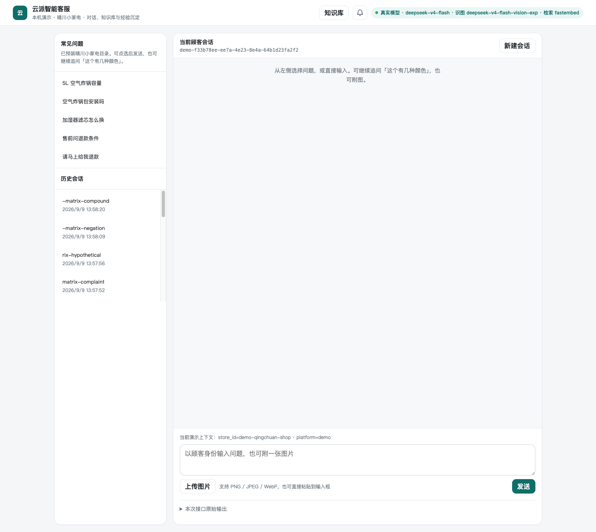
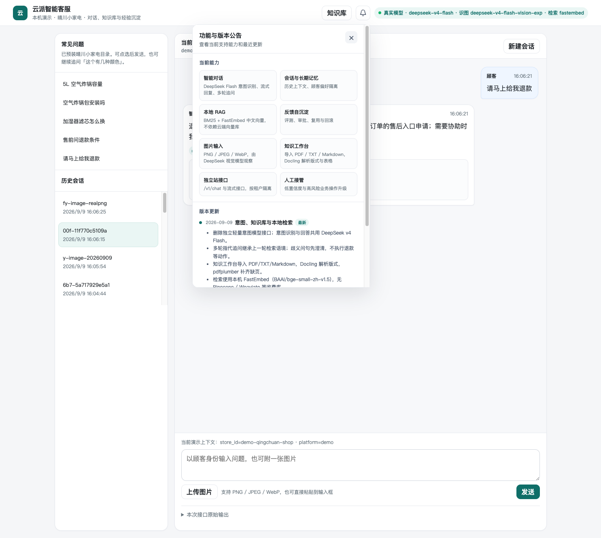
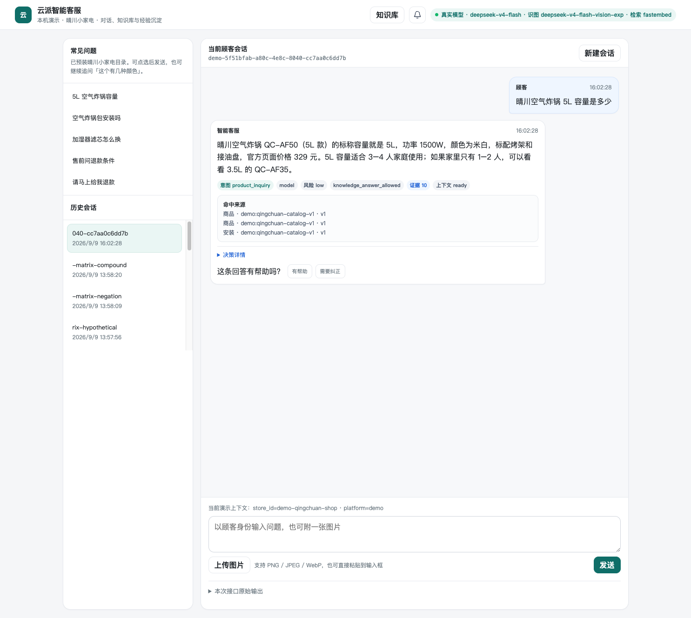
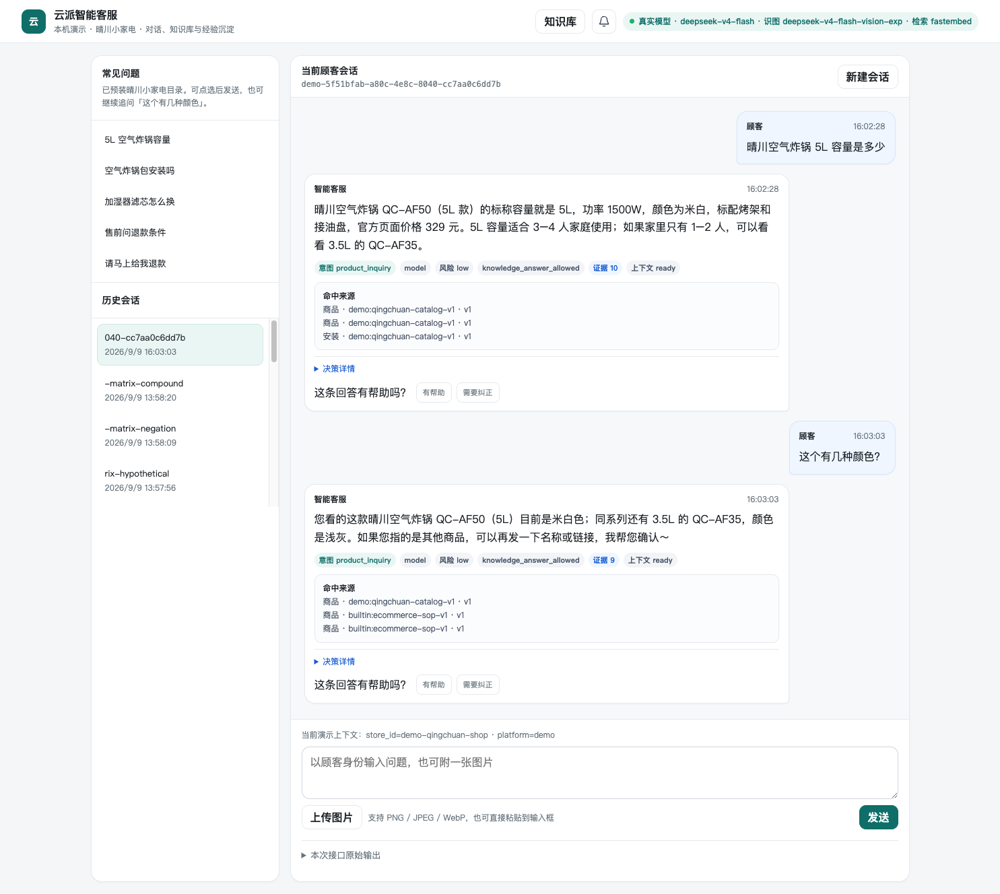
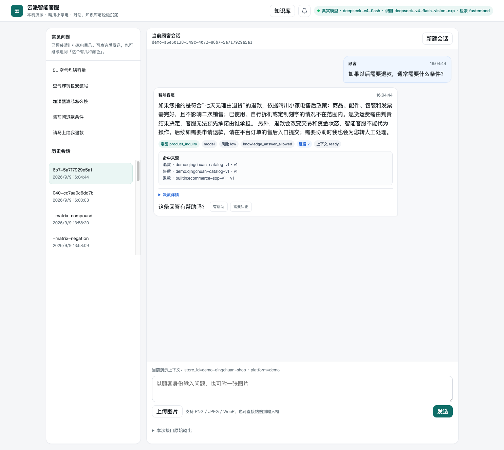
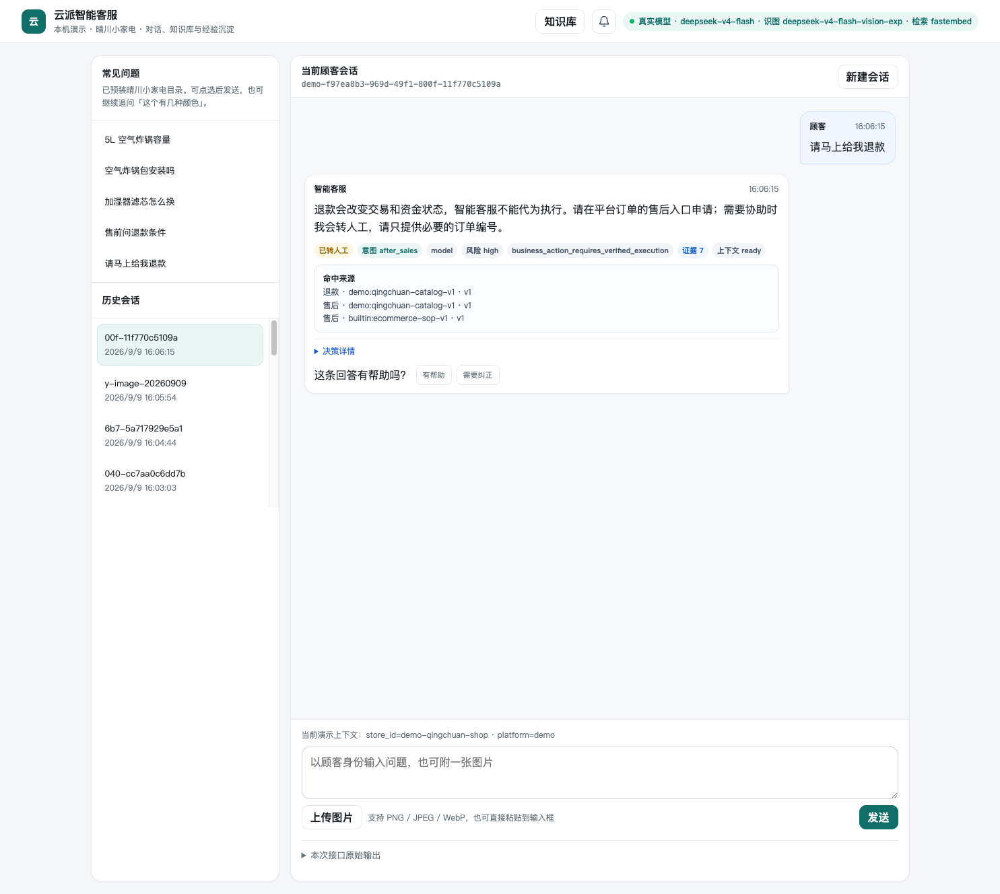
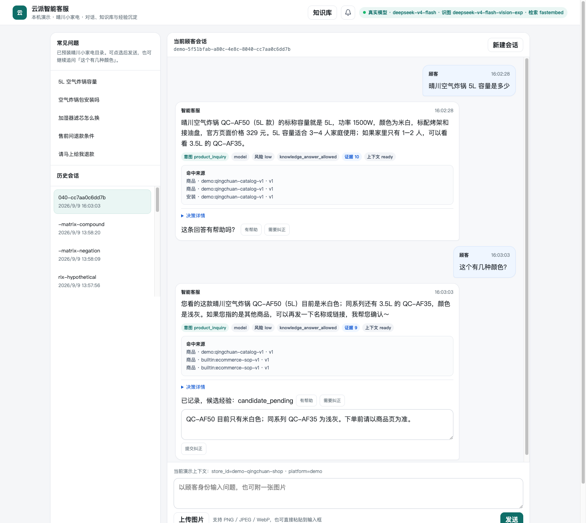
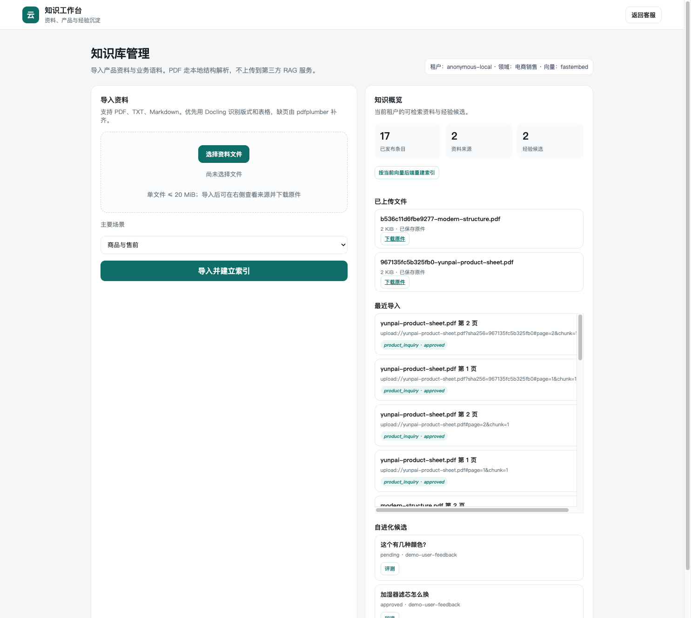
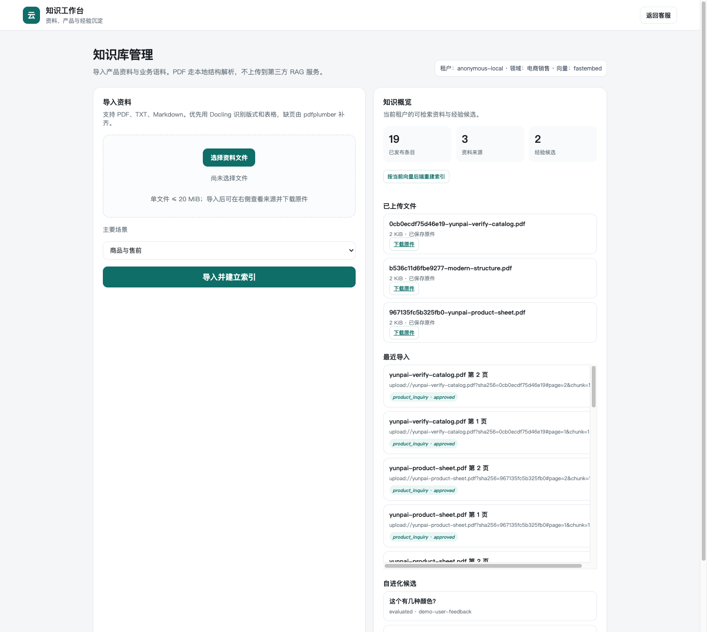

# 智能客服独立验收记录（2026-09-09）

> 后续状态：2026-09-10 框架审计复现了本报告测试未覆盖的执行分叉与信任边界缺陷。请同时阅读 [后续审计](framework-audit-2026-09-10.md)；本文件保留当时复测记录，不作为当前生产放行结论。

本文件覆盖 Codex 会话声称完成后的**二次验收**。浏览器为 Cursor 侧边浏览器，不是 Chromium 测试运行时。密钥未写入。

## 运行边界

- 启动：仓库根目录已有 `source env.md && yunpai-cs-demo --host 127.0.0.1 --port 8765`。
- 当时健康接口：`model_mode=live`，文本 `deepseek-v4-flash`，视觉 `deepseek-v4-flash-vision-exp`，检索 `fastembed` / `BAAI/bge-small-zh-v1.5`。
- 数据：本地 `data/`，模拟店「晴川小家电」。

## 用户路径

| 场景 | 操作 | 结果 | 证据 |
|---|---|---|---|
| 首页与模型状态 | 打开 `/` | 标题「云派智能客服」；状态条为真实 Flash + 视觉 + fastembed |  |
| 铃铛 | 点击右上角铃铛 | 当前能力含 Flash 意图、本地 RAG、Docling、独立站接口；已删除「图片理解需配置视觉模型」 |  |
| 商品问答 | 点「5L 空气炸锅容量」并发送 | `customer_intent=product_inquiry`，`intent_method=model`，答 QC-AF50 / 5L / 1500W / 329 元 |  |
| 多轮指代 | 同一会话输入「这个有几种颜色？」 | 继承 QC-AF50，米白；同系列 QC-AF35 浅灰 |  |
| 歧义售前 | 新会话「如果以后需要退款，通常需要什么条件？」 | 仍为 `product_inquiry`；讲七天无理由条件，不执行退款 |  |
| 高风险动作 | 新会话「请马上给我退款」 | `after_sales`，已转人工，风险 high |  |
| 图片（过小 PNG） | `POST /api/chat` 附 10×10 PNG | `vision_status=error`，文本仍澄清，未授权售后 | [evidence-verify-image.json](evidence-verify-image.json) 会被后续真实图覆盖；该失败记在 live JSON |
| 图片（正常 PNG） | 附 320×240 空气炸锅示意图 | `vision_status=applied`，识别为空气炸锅，未授权售后 | [evidence-verify-image.json](evidence-verify-image.json) |
| 纠正反馈 | 点「需要纠正」并提交修正 | `已记录，候选经验：candidate_pending` |  |
| 评测门禁 | 知识工作台点「评测」 | 状态 `evaluated`，`gate_passed=false`（`numeric_claim_without_evidence`），无「批准发布」 | 候选 API 摘要见 [evidence-verify-live.json](evidence-verify-live.json) |
| 知识工作台 | 从客服页点「知识库」 | `/admin` 可见导入、原件、经验候选 |  |
| PDF 导入 | `POST /api/knowledge/import` 两页含表 PDF | `count=2`，page1 `tables=1`，工作台出现 `yunpai-verify-catalog.pdf` |  |

汇总 JSON：[evidence-verify-live.json](evidence-verify-live.json)。

## 自动化

```text
.venv/bin/python -m pytest -q tests/test_demo_chat.py tests/test_intent.py tests/test_knowledge_ingest.py tests/test_embeddings.py tests/test_api.py tests/test_domain_profiles.py
31 passed

.venv/bin/python -m pytest -q
81 passed
```

另有 10 条上游弃用警告（Docling OCR/表格选项和 Starlette/httpx），没有测试失败。

意图测试：含「多少钱」的消息仍调用模型；否定句完整传递；网关无独立意图模型参数。PDF 测试：页码、来源、租户隔离。页面测试：铃铛含 FastEmbed / Docling / 删除轻量意图接口。

## 实现边界（不要把未验证写成完成）

- 意图分类走 DeepSeek Flash；四个控制桶之后才映射 SOP。安全护栏仍用规则拦截注入和高风险资金动作。
- 自进化必须过评测门禁。本轮颜色纠正因数字/证据校验未通过，所以没有发布到生产知识。
- 视觉模型对无效/过小图片会 `error`，对正常 PNG 为 `applied`。图片不能授权退款。
- 真实独立站渠道、HR 实际数据与 SOP、生产权限隔离仍需外部接入。

## 技术参考

- [Docling](https://docling-project.github.io/docling/)
- [FastEmbed](https://qdrant.tech/documentation/fastembed/)
- [pdfplumber](https://github.com/jsvine/pdfplumber)
- 本仓库说明：[rag-technology-notes.md](rag-technology-notes.md)
